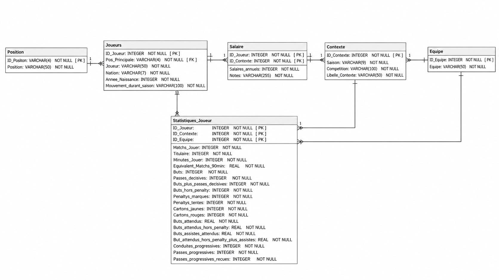

# SportDataPulse — Analyse des performances Ligue 1 2024-2025

> Projet du parcours **Business Intelligence Analyst** (OpenClassrooms), réalisé dans une mise en situation professionnelle.
> **Outils :** SQL · SQLite / SQLiteStudio · SQL Power Architect · Excel

## Contexte

SportDataPulse accompagne un club de football professionnel qui souhaite s'appuyer davantage sur ses données. Le directeur sportif a besoin d'analyses fiables pour comparer les joueurs et les équipes, et pour orienter le recrutement.

Ma mission : reformuler le besoin, modéliser et alimenter une base de données relationnelle, puis répondre en SQL à **11 questions métier** et formuler une **recommandation de recrutement**.

## Données

- Statistiques de Ligue 1 2024-2025, arrêtées à la 33e journée (source : FBref).
- **612 joueurs uniques** et 623 lignes de statistiques. Un joueur transféré en cours de saison garde une seule identité, mais ses statistiques restent séparées par club.
- Les salaires sont des **estimations non vérifiées**. Cette limite est documentée dans le dictionnaire de données.

*Les données brutes ne sont pas publiées dans ce dépôt, afin de respecter les conditions d'utilisation de la source.*

## Démarche

1. **Cadrage :** reformulation du besoin en 11 questions regroupées en 7 axes d'analyse.
2. **Préparation :** harmonisation des noms et des formats, contrôle des doublons et des valeurs manquantes, gestion des joueurs transférés.
3. **Modélisation :** modèle relationnel normalisé de 6 tables (`Joueurs`, `Statistiques_Joueur`, `Equipe`, `Position`, `Salaire`, `Contexte`), avec clés primaires et étrangères et des contraintes `CHECK` (par exemple, buts hors penalty = buts − penalties marqués).
4. **Base SQLite :** création, import, puis contrôle de l'intégrité référentielle (`PRAGMA foreign_key_check`).
5. **Analyses SQL et restitution :** résultats interprétés pour un public non technique.

## Résultats clés

| Question | Résultat |
|---|---|
| Buts vs xG par équipe | Paris SG : 86 buts pour 87,5 xG. Lens : 36 buts pour 51,7 xG (−15,7), soit une forte sous-performance à la finition. |
| Répartition par poste | Défenseurs 34,8 %, milieux 29,7 %, attaquants 25,0 %, gardiens 10,5 % |
| Attaquants | 3,35 buts en moyenne par attaquant actif. 67 % d'entre eux ont marqué au moins une fois. |
| Meilleurs buteurs | Dembélé (21), Greenwood (19), Kalimuendo (17) |
| Efficacité vs xG | Dembélé : +5,4 buts au-dessus de ses xG |
| Progression du ballon | Højbjerg : 258 passes progressives. Leader par club calculé avec `ROW_NUMBER() OVER (PARTITION BY ...)`. |

## Recommandation recrutement

Critères : attaquant, profil finisseur (peu de passes progressives), salaire annuel inférieur à 3 M€.
**10 candidats identifiés et 3 profils prioritaires :**

- **Emanuel Emegha** : 14 buts, 750 k€. C'est le meilleur compromis sportif.
- **Mika Biereth** : 13 buts, 1,15 M€. Jeune et déjà très efficace.
- **Estéban Lepaul** : 9 buts, 270 k€. C'est le meilleur rapport coût / performance.

## Compétences SQL mobilisées

`JOIN` / `LEFT JOIN` · `GROUP BY` / `HAVING` · sous-requêtes · `CASE` (dont la gestion d'une division par zéro) · CTE (`WITH`) · fonction de fenêtrage `ROW_NUMBER()` · contraintes `CHECK`, `UNIQUE` et `FOREIGN KEY`

## Contenu du dépôt

| Fichier | Description |
|---|---|
| `expression_besoin.pdf` | Cadrage du besoin et des 11 questions |
| `dictionnaire_donnees.xlsx` | Dictionnaire de données des 6 tables (types, règles de gestion et de calcul) |
| `schema_relationnel.png` | Schéma relationnel final |
| `01_creation_tables.sql` | Script de création de la base avec ses contraintes |
| `requetes_sql.pdf` | Les requêtes SQL, leurs résultats et leurs interprétations |
| `presentation.pdf` | Présentation des résultats au directeur sportif |

## Auteur

**Antony Labandibar**, en formation Business Intelligence Analyst. Je recherche un stage BI / Data Analyst en avril-mai 2027 (Seine-et-Marne).
[LinkedIn](https://www.linkedin.com/in/antony-labandibar)
